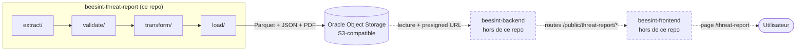
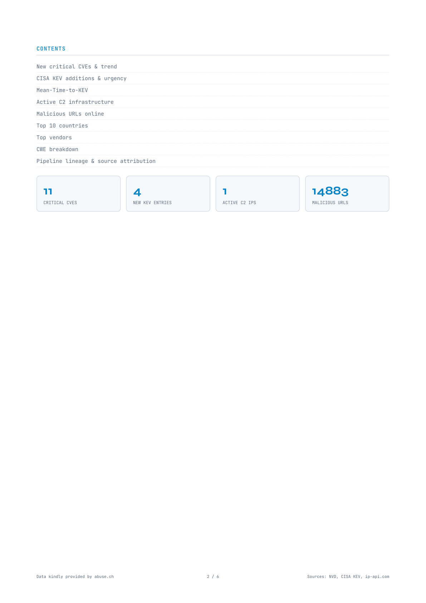
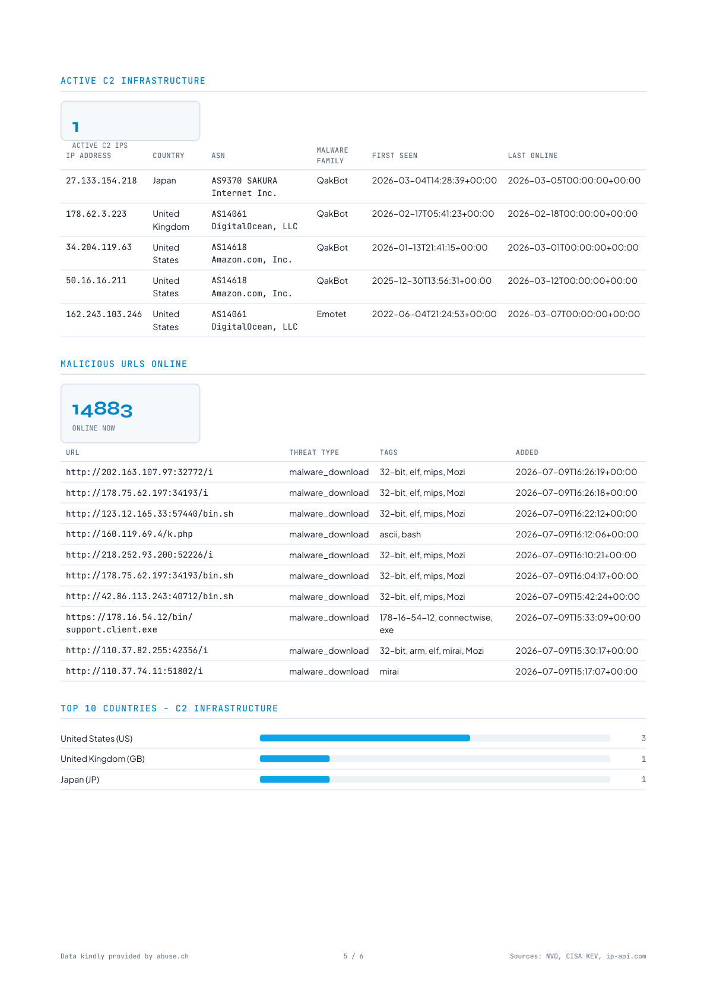

# BeeSINT Threat Report

Pipeline ETL hebdomadaire de cyber threat intelligence : agrège CVE critiques (NVD), vulnérabilités
exploitées activement (CISA KEV), infrastructure C2 active et URLs malveillantes (abuse.ch), les
valide/transforme avec Polars + Pydantic + Pandera, puis publie un rapport (JSON + PDF + historique
Parquet) sur un stockage objet S3-compatible. Réalisé pour démontrer les compétences d'un poste
**Data Engineer Cyber** : pipeline data reproductible, validation de schéma, observabilité, sécurité
cloud.

## Compétences démontrées

| Choix technique | Compétence démontrée | Mot-clé marché |
|---|---|---|
| Polars pour l'ETL | Manipulation de données performante | Polars, ETL |
| Pydantic + Pandera (double validation) | Data quality, contrats de schéma | Data validation, schema enforcement |
| Parquet partitionné (historique) | Formats colonnaires, requêtes analytiques | Parquet, DuckDB-ready |
| Oracle Object Storage (S3-compatible) + presigned URL | Stockage objet, sécurité d'accès | Object storage, IAM, presigned URL |
| Intégration propre dans une API existante (routes + sécurité héritées) | Travail dans une base de code existante, pas de sur-ingénierie | Integration engineering, code reuse |
| GitHub Actions (CI + cron ETL) | Intégration/déploiement continu | CI/CD, DevOps |
| Sentry + anomaly checks | Observabilité, data quality monitoring | Monitoring, observability |
| IAM scopé + gitleaks + pre-commit | Posture sécurité cloud | Cloud security, least privilege |
| ip-api + react-leaflet (carte) | Visualisation géospatiale | GeoIP, dataviz |
| Jointure NVD×KEV (Mean-Time-to-KEV) | Modélisation analytique, cross-source join | Data modeling, analytics engineering |
| Webhook interne + table DB | Intégration systèmes, API interne | System integration |
| tenacity (retry) + cache local | Résilience pipeline | Fault tolerance, idempotency |

## Architecture



Traits pointillés = composants externes à ce repo, gérés par les repos `beesint-backend`/
`beesint-frontend` existants — voir note d'intégration en fin de README.

## Aperçu du rapport


*Rapport hebdomadaire — vue KPIs*


*Rapport — infrastructure C2 active et répartition par pays*

## Quickstart

```powershell
python -m venv .venv
.\.venv\Scripts\Activate.ps1
pip install -r requirements.txt
copy .env.example .env   # puis remplir les clés (voir table variables d'env)
python -m beesint_threat_report.orchestrate
```

Tests : `pip install -r requirements-dev.txt` puis `pytest`.

Commandes annexes : `python -m beesint_threat_report.orchestrate --force-refresh` (ignore le cache
local et refetch toutes les sources) et `python -m beesint_threat_report.backfill` (remplit
l'historique Parquet avec des périodes antérieures, à lancer une fois au déploiement initial).

## Runbook Oracle — bucket Object Storage uniquement

Aucune VM ni reverse-proxy à provisionner pour ce repo — l'API qui lira ces données vit dans
`beesint-backend`, déployée via son pipeline existant. La seule infrastructure cloud nouvelle est
le bucket Object Storage ci-dessous, provisionné intégralement en parcours UI web (console Oracle
Cloud) :

1. Créer un compartment dédié (ou réutiliser un compartment existant) dans la console Oracle Cloud.
2. Créer un bucket Object Storage privé (visibility "Private"), noter la région et le nom du
   bucket.
3. Créer un groupe IAM dédié (ex. `threat-report-etl`), policy scopée au compartment (lecture +
   écriture sur ce bucket uniquement — principe de moindre privilège).
4. Générer une Customer Secret Key (paire access key / secret key S3-compatible) pour ce groupe.
5. Optionnel mais recommandé : une seconde Customer Secret Key scopée lecture-seule, destinée à
   `beesint-backend` (routes publiques + presigned URL) — générée au même endroit, mais son usage
   sort du périmètre de ce repo.
6. Vérification finale : tenter un accès public direct à une URL d'objet du bucket (sans presigned
   URL) → doit échouer (403/404).

   ```powershell
   curl.exe -i "https://<namespace>.compat.objectstorage.<region>.oraclecloud.com/<bucket>/manifest.json"
   ```

   Exemple (ce bucket) :

   ```powershell
   curl.exe -i "https://axtfnfa4et7g.compat.objectstorage.eu-paris-1.oraclecloud.com/beesint-threat-report/manifest.json"
   ```

   Résultat attendu : `HTTP/1.1 403 Forbidden` (ou `404`) — jamais `200`. À rejouer après chaque
   changement de policy IAM. Noter la commande + le code retour obtenu dans l'issue/PR de clôture
   du lot (checklist go-live, point 4) — un test fait une fois sans trace ne compte pas comme
   vérifié.

   Dernière exécution réelle : 2026-07-10, `404` — accès public direct refusé, conforme.

## Variables d'environnement

| Variable | Description | Où l'obtenir |
|---|---|---|
| `NVD_API_KEY` | Clé API NVD (augmente le rate limit) | Inscription gratuite sur nvd.nist.gov/developers/request-an-api-key |
| `THREATFOX_AUTH_KEY` | Clé ThreatFox (abuse.ch), optionnelle — absente : étape sautée proprement | Inscription gratuite sur auth.abuse.ch |
| `ORACLE_S3_ACCESS_KEY` | Access key S3-compatible du bucket Oracle | Console Oracle Cloud, Customer Secret Key (voir runbook) |
| `ORACLE_S3_SECRET_KEY` | Secret key S3-compatible du bucket Oracle | Console Oracle Cloud, Customer Secret Key (voir runbook) |
| `ORACLE_S3_ENDPOINT` | Endpoint S3-compatible du tenancy Oracle | Console Oracle Cloud, page du bucket |
| `ORACLE_S3_BUCKET` | Nom du bucket Object Storage | Créé au runbook ci-dessus |
| `THREAT_REPORT_INTERNAL_SECRET` | Secret partagé pour le webhook interne vers `beesint-backend` | Généré manuellement ; doit avoir la même valeur côté `.env` de `beesint-backend` |
| `SENTRY_DSN_THREAT_REPORT` | DSN Sentry du projet dédié à ce pipeline (séparé du Sentry backend) | Projet Sentry `beesint-threat-report` |
| `STORAGE_BACKEND` | `local` (défaut, dev) ou `s3` (nécessite les 4 variables `ORACLE_S3_*`) | — |
| `BACKEND_WEBHOOK_URL` | URL du webhook interne `beesint-backend` — absent : dry-run/log seul | Config de déploiement de `beesint-backend` |
| `REPORT_WINDOW_DAYS` | Fenêtre du rapport en jours (défaut 7) | — |
| `MAX_RESULTS_NVD` / `MAX_RESULTS_KEV` | Caps volumétriques par source (défauts raisonnables) | — |
| `ENVIRONMENT` | Tag d'environnement Sentry | — |

## Attribution des sources

- **abuse.ch** (FeodoTracker, URLhaus, ThreatFox) : *"Data kindly provided by abuse.ch"*.
- **ip-api.com** : usage gratuit non-commercial ; endpoint batch en HTTP uniquement sur le tier
  gratuit (HTTPS = tier payant) — posture assumée, ce projet est un portfolio non-commercial.
- **CartoDB** (tuiles `dark_all`, utilisées côté carte frontend) : *"© CartoDB"*.
- **NVD / CISA KEV** : données publiques (domaine public US), pas de restriction de réutilisation.

## Licence

Le **code** de ce repo est sous licence [MIT](LICENSE).

Les **données sources** gardent chacune leurs propres conditions d'usage (voir section Attribution
ci-dessus) — la licence MIT du code ne s'applique pas aux données produites ou réexposées par ce
pipeline.

## Intégration BeeSINT

Les données produites par ce pipeline sont exposées publiquement via BeeSINT sur
[beesint.com/threat-report](https://beesint.com/threat-report) (routes API + page frontend ajoutées
à l'écosystème BeeSINT existant — hors périmètre de ce repo, voir diagramme ci-dessus).
